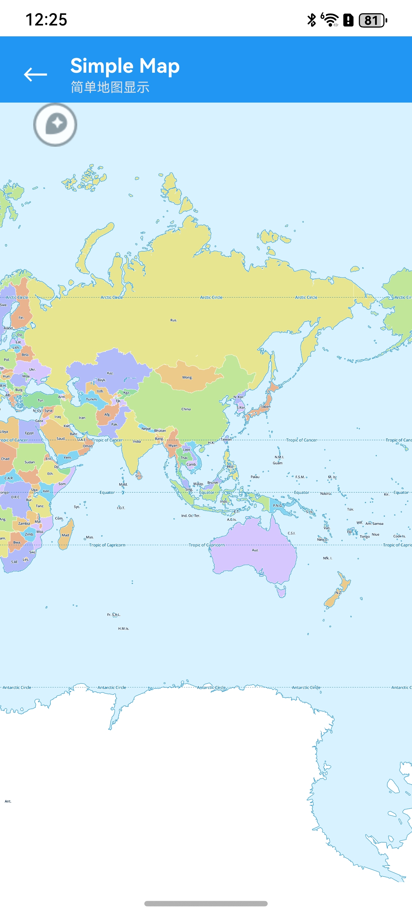
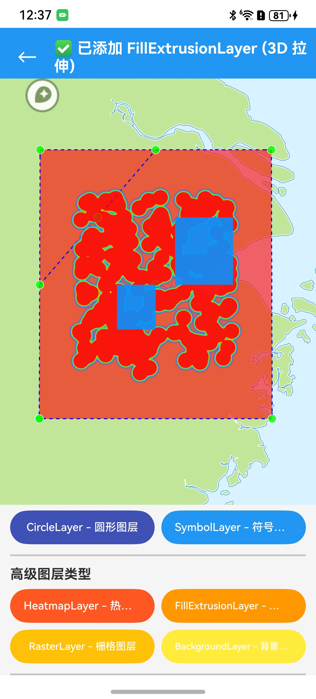

# MapLibre Native for HarmonyOS


OpenGL-based vector map rendering library for HarmonyOS.

> ⚠️ **IMPORTANT: Development Status - Alpha/Unstable**
> 
> This project is currently under **active development** and is **NOT production-ready**.
> 
> **Current Status**:
> - 🚧 **Stability**: Alpha stage - expect bugs, crashes, and memory leaks
> - 🔄 **API Changes**: Breaking changes WILL occur without notice
> - 🧪 **Testing**: Limited testing coverage, many edge cases untested  
> - 📝 **Documentation**: Work in progress, incomplete
> - ⚡ **Performance**: Not optimized for production workloads
> - 🔒 **Security**: Security review not yet performed
> 
> **⛔ NOT RECOMMENDED for production applications**
> 
> **Use at your own risk** - This software is provided "AS IS" without warranty of any kind.
> Only suitable for:
> - 🧪 Experimental projects
> - 📚 Learning and research
> - 🔬 Early testing and feedback
> 
> If you need production-ready map solutions, please use the mature Android or iOS platforms.

## Screenshots

<div align="center">
  
  
  <br/>
  <em>Left: Basic map rendering | Right: Advanced layer testing</em>
</div>

## Features

- 🗺️ Vector map rendering using OpenGL ES
- 📍 Marker and annotation support
- 🎨 Customizable map styles
- 📊 Multiple data source types (GeoJSON, Vector, Raster)
- 🎯 Rich gesture support
- 📷 Camera animations and controls
- 🧮 Expression system for dynamic styling
- 💾 Offline map support
- 📸 Map snapshot generation


## Feature Comparison: HarmonyOS vs Android vs iOS

| Feature Category          | Feature                           | HarmonyOS | Android | iOS |
| ------------------------- | --------------------------------- | --------- | ------- | --- |
| **Core Map**              | Vector Tile Rendering             | ✅         | ✅       | ✅   |
|                           | Style Loading (JSON/URL)          | ✅         | ✅       | ✅   |
|                           | Map Initialization                | ✅         | ✅       | ✅   |
|                           | Map Destruction                   | ✅         | ✅       | ✅   |
| **Camera Control**        | Move Camera                       | ✅         | ✅       | ✅   |
|                           | Animate Camera                    | ✅         | ✅       | ✅   |
|                           | Ease Camera                       | ✅         | ✅       | ✅   |
|                           | Fly To                            | ✅         | ✅       | ✅   |
|                           | Get Camera Position               | ✅         | ✅       | ✅   |
|                           | Set Bounds                        | ✅         | ✅       | ✅   |
|                           | Min/Max Zoom                      | ✅         | ✅       | ✅   |
|                           | Min/Max Pitch                     | ✅         | ✅       | ✅   |
| **Gestures**              | Pan (Scroll)                      | ✅         | ✅       | ✅   |
|                           | Pinch Zoom                        | ✅         | ✅       | ✅   |
|                           | Rotate                            | ✅         | ✅       | ✅   |
|                           | Tilt (Pitch)                      | ✅         | ✅       | ✅   |
|                           | Double Tap Zoom                   | ✅         | ✅       | ✅   |
|                           | Quick Zoom                        | ✅         | ✅       | ✅   |
|                           | Gesture Enable/Disable            | ✅         | ✅       | ✅   |
| **Markers & Annotations** | Add/Remove Marker                 | ✅         | ✅       | ✅   |
|                           | Marker Click Events               | ✅         | ✅       | ✅   |
|                           | Custom Marker Icons               | ✅         | ✅       | ✅   |
|                           | Polylines                         | ✅         | ✅       | ✅   |
|                           | Polygons                          | ✅         | ✅       | ✅   |
|                           | Info Windows                      | ⚠️         | ✅       | ✅   |
| **Style Control**         | Runtime Styling                   | ✅         | ✅       | ✅   |
|                           | Add/Remove Layers                 | ✅         | ✅       | ✅   |
|                           | Layer Properties                  | ✅         | ✅       | ✅   |
|                           | Filter Expressions                | ✅         | ✅       | ✅   |
|                           | Data-Driven Styling               | ✅         | ✅       | ✅   |
|                           | Add/Remove Images                 | ✅         | ✅       | ✅   |
|                           | Light Settings                    | ❌         | ✅       | ✅   |
| **Data Sources**          | GeoJSON Source                    | ✅         | ✅       | ✅   |
|                           | Vector Source                     | ✅         | ✅       | ✅   |
|                           | Raster Source                     | ✅         | ✅       | ✅   |
|                           | Raster DEM Source                 | ✅         | ✅       | ✅   |
|                           | Image Source                      | ✅         | ✅       | ✅   |
|                           | Video Source                      | ❌         | ✅       | ✅   |
| **Event Listeners**       | Map Click                         | ✅         | ✅       | ✅   |
|                           | Map Long Click                    | ✅         | ✅       | ✅   |
|                           | Camera Change                     | ✅         | ✅       | ✅   |
|                           | Camera Idle                       | ✅         | ✅       | ✅   |
|                           | Map Load                          | ✅         | ✅       | ✅   |
|                           | Style Load                        | ✅         | ✅       | ✅   |
|                           | Source Changed                    | ✅         | ✅       | ✅   |
|                           | 26 Event Listeners                | ✅         | ✅       | ✅   |
| **Performance**           | FPS Control                       | ✅         | ✅       | ✅   |
|                           | Render Mode (Continuous/OnDemand) | ✅         | ✅       | ✅   |
|                           | Prefetch Tiles                    | ❌         | ✅       | ✅   |
|                           | LOD Configuration                 | ❌         | ❌       | ✅   |
|                           | Debug Info                        | ❌         | ✅       | ✅   |
| **UI Settings**           | Compass                           | 🚧         | ✅       | ✅   |
|                           | Logo                              | 🚧         | ✅       | ✅   |
|                           | Attribution                       | 🚧         | ✅       | ✅   |
|                           | Scale Bar                         | 🚧         | ✅       | ✅   |
| **Offline Maps**          | Download Regions                  | ⚠️         | ✅       | ✅   |
|                           | Offline Manager                   | ⚠️         | ✅       | ✅   |
|                           | Region Status                     | ⚠️         | ✅       | ✅   |
|                           | Pack Database                     | ⚠️         | ✅       | ✅   |
| **Snapshots**             | Take Snapshot                     | ✅         | ✅       | ✅   |
|                           | Snapshot Options                  | ✅         | ✅       | ✅   |
|                           | Async Snapshot                    | 🚧         | ✅       | ✅   |
| **Query Features**        | Query Rendered Features           | ✅         | ✅       | ✅   |
|                           | Query Source Features             | ✅         | ✅       | ✅   |
|                           | Get Cluster Children              | 🚧         | ✅       | ✅   |
|                           | Get Cluster Leaves                | 🚧         | ✅       | ✅   |
| **Coordinate Conversion** | LatLng to Screen                  | ✅         | ✅       | ✅   |
|                           | Screen to LatLng                  | ✅         | ✅       | ✅   |
|                           | Meters to LatLng                  | ✅         | ✅       | ✅   |

### Legend
- ✅ **Fully Supported** - Feature is implemented and tested
- ⚠️ **Partial Support** - Feature is available with limitations
- ❌ **Not Supported** - Feature is not yet implemented
- 🚧 **In Progress** - Feature is under development

### Notes

1. **HarmonyOS** implementation follows MapLibre GL JS API design with Android/iOS conventions
2. All core features are **API-compatible** with Android and iOS versions
3. **OpenGL ES 3.0** backend provides hardware-accelerated rendering
4. **Thread-safe** callbacks enable seamless cross-thread communication
5. **DPI-aware** coordinate transformations ensure proper scaling on high-resolution displays

## Architecture

### Thread Model

MapLibre Native for HarmonyOS uses a multi-threaded architecture to ensure smooth performance:

```text
┌─────────────────────────────────────────────────────────────────────┐
│                          Thread Architecture                        │
└─────────────────────────────────────────────────────────────────────┘

┌──────────────────────────┐      ┌──────────────────────────────┐
│     UI/Main Thread       │      │    Render Thread             │
│   (ArkTS/NAPI Layer)     │      │  (Map + OpenGL Rendering)    │
├──────────────────────────┤      ├──────────────────────────────┤
│                          │      │                              │
│  • User Interactions     │      │  • Map Core Instance         │
│  • Event Callbacks       │      │  • Renderer Instance         │
│  • UI Updates            │◀────▶│  • EGL Context               │
│  • API Calls             │ ①②  │  • OpenGL Drawing            │
│  • NativeMapView         │      │  • RunLoop (libuv)           │
│                          │      │  • VSync Management          │
└────────────┬─────────────┘      └────────────┬─────────────────┘
             │                                 │
             │ ③ ThreadSafeCallback           │ ④ Async Tasks
             │                                 │
             ▼                                 ▼
┌──────────────────────────────────────────────────────────────────┐
│                       Resource Thread Pool                       │
│                   (Network & File Operations)                    │
├──────────────────────────────────────────────────────────────────┤
│                                                                  │
│  • HTTP Requests (libcurl)          • Tile Downloads             │
│  • File I/O Operations              • Image Decoding             │
│  • Style Loading                    • GeoJSON Parsing            │
│  • Database Access (SQLite)         • Asset Loading              │
│                                                                  │
└──────────────────────────────────────────────────────────────────┘
```

### Communication Mechanisms

**① API Calls (UI → Render Thread)**

<!-- ```text
User calls mapInstance.moveCamera()
  ↓
ArkTS → NAPI Bridge
  ↓
RunLoop::invoke() schedules task on Render Thread
  ↓
Map updates camera position
  ↓
Triggers rendering via VSync
``` -->

**② Event Callbacks (Render Thread → UI Thread)**

<!-- ```text
Map event occurs (e.g., onClick, onLoad)
  ↓
Map notifies observers
  ↓
ThreadSafeCallback queues callback
  ↓
NAPI converts to napi_value
  ↓
ArkTS listener invoked on UI thread
``` -->

**③ ThreadSafeCallback System**

<!-- ```text
┌─────────────────────────────────────────────┐
│       ThreadSafeCallback Manager            │
├─────────────────────────────────────────────┤
│  • Thread-safe callback queue               │
│  • Automatic thread switching               │
│  • Reference counting for JS objects        │
│  • Safe cleanup on destruction              │
└─────────────────────────────────────────────┘
``` -->

**④ Resource Loading (Async)**

<!-- ```text
Map requests tile/style/image
  ↓
FileSource schedules network request
  ↓
Resource Thread Pool executes
  ↓
Downloads via libcurl
  ↓
Decodes/Parses data
  ↓
Callback to Render Thread via RunLoop
  ↓
Map updates and triggers render
``` -->

### Key Features

- **Single Render Thread**: Map and Renderer share one thread (iOS-style architecture)
- **Thread-Safe**: All cross-thread communication uses RunLoop and ThreadSafeCallback
- **Non-Blocking UI**: Resource loading never blocks user interaction
- **VSync-Driven**: Rendering synchronized with display refresh rate
- **Efficient**: Minimizes context switching and lock contention

## Installation

> ⚠️ **Warning**: This library is in **alpha stage**. Please evaluate thoroughly before using in any application.

### Prerequisites

- **HarmonyOS SDK**: 5.0.0 (API 12) or higher
- **DevEco Studio**: 5.0.5 or higher
- **Node.js**: 18.0.0 or higher

### From npm registry

> ⚠️ **Note**: This package is not yet published to npm/ohpm registry. Currently for development and testing only.

```bash
npm install maplibre-harmony
```

Add to your module's `oh-package.json5`:

```json5
{
  "dependencies": {
    "maplibre_harmony": "file:./node_modules/maplibre-harmony/maplibre_harmony.har"
  }
}
```

## Usage

> ⚠️ **Alpha Software Notice**: The following APIs are subject to change. Always check the latest documentation before upgrading.

### Basic Map

```typescript
import { MapView, MapLibreMap, DEFAULT_STYLE_URLS, LatLng } from 'maplibre_harmony';

@Entry
@Component
struct MapPage {
  private mapController: MapLibreMap | null = null;
  @State private isMapReady: boolean = false;

  aboutToDisappear(): void {
    if (this.mapController) {
      this.mapController.destroy();
      this.mapController = null;
    }
  }

  build() {
    Column() {
      MapView({
        styleUrl: DEFAULT_STYLE_URLS.streets,
        initialLatitude: 39.916527,
        initialLongitude: 116.397128,
        initialZoom: 12,
        onMapReady: (map: MapLibreMap): void => {
          this.mapController = map;
          this.isMapReady = true;
          console.info('[MapPage] Map ready');
        }
      })
        .width('100%')
        .height('100%');
    }
    .width('100%')
    .height('100%');
  }
}
```

### Adding Markers

```typescript
import { MapLibreMap, Marker, MarkerOptions, LatLng } from 'maplibre_harmony';

async function addMarkerExample(map: MapLibreMap): Promise<void> {
  const marker = await map.addMarker(
    new MarkerOptions()
      .position(new LatLng(39.916527, 116.397128))
      .title('Beijing')
      .snippet('Capital of China')
  );

  map.setOnMarkerClickListener({
    onMarkerClick: (clickedMarker: Marker): boolean => {
      console.info(`Marker clicked: ${clickedMarker.getTitle()}`);
      return false; // false keeps the default InfoWindow visible
    }
  });

  marker.showInfoWindow();
}
```

### Camera Animations

```typescript
import { MapLibreMap, CameraPosition, LatLng } from 'maplibre_harmony';

function animateToShanghai(map: MapLibreMap): void {
  const target: CameraPosition = {
    target: new LatLng(31.230416, 121.473701),
    zoom: 14,
    bearing: 0,
    tilt: 0
  };

  map.animateCamera(target, 1000, {
    onFinish: () => console.info('Animation finished'),
    onCancel: () => console.info('Animation cancelled')
  });

  map.flyTo(
    {
      center: new LatLng(121.473701, 31.230416),
      zoom: 15,
      bearing: 45,
      pitch: 60
    },
    1500,
    {
      onFinish: () => console.info('Fly animation finished')
    }
  );
}
```

### Event Listeners

```typescript
import {
  MapLibreMap,
  LatLng,
  OnMapClickListener,
  OnCameraMoveListener,
  OnDidFinishLoadingStyleListener
} from 'maplibre_harmony';

class MapClickLogger implements OnMapClickListener {
  private map: MapLibreMap;

  constructor(map: MapLibreMap) {
    this.map = map;
  }

  onMapClick(x: number, y: number): boolean {
    const latLng: LatLng = this.map.latLngForPixel(x, y);
    console.info(`Tap at: ${latLng.latitude}, ${latLng.longitude}`);
    return false;
  }
}

class CameraMoveLogger implements OnCameraMoveListener {
  private map: MapLibreMap;

  constructor(map: MapLibreMap) {
    this.map = map;
  }

  onCameraMove(): void {
    const position = this.map.getCameraPosition();
    if (position) {
      console.info(`Camera -> zoom: ${position.zoom}, bearing: ${position.bearing}`);
    }
  }
}

class StyleLoadedLogger implements OnDidFinishLoadingStyleListener {
  onDidFinishLoadingStyle(): void {
    console.info('Style loaded, ready to add layers');
  }
}

function registerListeners(map: MapLibreMap): void {
  map.addOnMapClickListener(new MapClickLogger(map));
  map.addOnCameraMoveListener(new CameraMoveLogger(map));
  map.addOnDidFinishLoadingStyleListener(new StyleLoadedLogger());
}
```

### Runtime Styling

```typescript
import { MapLibreMap, GeoJsonSource, CircleLayer } from 'maplibre_harmony';

function addCircleLayer(map: MapLibreMap): void {
  const style = map.getStyle();
  if (!style) {
    console.warn('Style is not ready');
    return;
  }

  const source = GeoJsonSource.fromGeoJson('poi-source', JSON.stringify({
    type: 'FeatureCollection',
    features: [
      {
        type: 'Feature',
        geometry: {
          type: 'Point',
          coordinates: [116.397128, 39.916527]
        },
        properties: {
          name: 'Beijing'
        }
      }
    ]
  }));
  style.addSource(source);

  const circleLayer = CircleLayer.create('poi-layer', 'poi-source')
    .setCircleRadius(10)
    .setCircleColor('#FF0000');
  style.addLayer(circleLayer);
}
```

## API Quick Reference

### Core Classes

- **`MapLibreMap`** - Main map instance
- **`NativeMapView`** - ArkTS map component
- **`CameraPosition`** - Camera position and orientation
- **`LatLng`** - Geographic coordinates
- **`LatLngBounds`** - Geographic bounds

### Key Methods

| Method                    | Description                        |
| ------------------------- | ---------------------------------- |
| `moveCamera()`            | Move camera instantly              |
| `animateCamera()`         | Animate camera smoothly            |
| `flyTo()`                 | Fly to location with easing        |
| `addMarker()`             | Add a marker to the map            |
| `addPolyline()`           | Add a polyline                     |
| `addPolygon()`            | Add a polygon                      |
| `getStyle()`              | Get style for runtime manipulation |
| `queryRenderedFeatures()` | Query features at point            |
| `snapshot()`              | Take a map snapshot                |

### Event Listeners (26 total)

- Map Events: `onClick`, `onLongClick`, `onFling`
- Camera Events: `onMove`, `onMoveStart`, `onMoveEnd`, `onIdle`
- Style Events: `onStyleLoaded`, `onStyleImageMissing`
- Source Events: `onSourceChanged`, `onSourceDataLoaded`
- And 15 more...

For complete API documentation, see the [`/docs`](./docs/) directory.

## Building from Source

### Build Commands

```bash
cd platform/harmony/maplibre_harmony

./pre-release.sh
```

### Build Output

The compiled HAR will be at:
```
build/default/outputs/default/maplibre-harmony.har
```

## Troubleshooting

> ⚠️ **Known Issues**: This is alpha software. Many edge cases and stability issues are still being addressed.

### Map not rendering
1. Verify OpenGL ES 3.0 support
2. Check style URL accessibility
3. Inspect HiLog: `hdc hilog | grep MapLibre`
4. **Known Issue**: Map may crash on repeated page transitions (being fixed)

### Multiple maps limitation

> ⚠️ **IMPORTANT**: Multiple map instances on the same screen are **NOT supported** currently.
>
> **Current Limitation**:
>
> - Only **ONE** map instance can be rendered on screen at a time
> - Creating multiple `NativeMapView` components simultaneously will cause rendering conflicts
> - Switching between maps requires proper cleanup of the previous instance
>
> **Status**: 🚧 Multi-map support is **planned** and under investigation
>
> **Workaround**: Use navigation or tabs to display maps one at a time

### Build errors
1. Clean build cache: `npm run clean`
2. Verify environment variables are set
3. Check HarmonyOS SDK version (≥5.0.0)
4. **Known Issue**: Incremental builds may fail, try clean build

### Gesture issues
1. Ensure proper DPI configuration
2. Check XComponent touch event handling
3. Verify gesture settings are enabled
4. **Known Issue**: Some gesture combinations may not work as expected

### Stability issues
1. **Memory leaks**: May occur in long-running applications
2. **Thread safety**: Some race conditions still being addressed
3. **Crash recovery**: Limited error recovery mechanisms
4. **Performance**: Not optimized for production workloads

## Documentation

### API Documentation
- **[API Documentation Index](./docs/apis/INDEX.md)** 📚 - Complete API documentation hub
- **[API Reference](./docs/apis/README.md)** - Core API overview and quick start
- **[Usage Guide](./docs/apis/USAGE_GUIDE.md)** - Detailed usage examples and patterns
- **[Implementation Progress](./docs/api/ALIGNMENT_PROGRESS.md)** - API alignment status

## Examples

See the [`entry`](../entry/) module for complete working examples:
- Basic map display
- Marker management
- Camera animations
- Runtime styling
- Gesture handling
- Offline maps
- Custom layers

## Roadmap

### Planned Features

#### 🎯 High Priority

**Declarative API** 🚧 Planning

- Native ArkTS declarative API design
- Seamless integration with HarmonyOS ArkUI
- Type-safe, reactive map configuration
- Simplified component composition

**Multiple Map Support** 🚧 Planned

- Support rendering multiple map instances on the same screen
- Independent camera and style control for each instance
- Optimized resource sharing between instances

#### 🔬 Research & Investigation

**Vulkan Rendering Backend** 🔬 Under Investigation

- Modern graphics API support
- Potential performance improvements
- Better GPU utilization
- Cross-platform rendering consistency

**TextureView Support** 🔬 Under Investigation

- Alternative rendering mode for better composition
- Improved integration with ArkUI component tree
- Support for view transformations and effects
- Enhanced multi-map support

#### 📋 Future Considerations

- React Native bridge for cross-platform apps
- Advanced annotation customization (ComponentContent support)
- Enhanced offline map management
- Improved accessibility features
- Performance profiling tools

### Timeline

> ⚠️ **Note**: Timeline is subject to change. Features will be prioritized based on community feedback and technical feasibility.

- **Q1-Q2 2025**: Declarative API design & prototyping
- **Q2-Q3 2025**: Multiple map support implementation
- **Q3-Q4 2025**: Vulkan backend research & evaluation
- **2025+**: TextureView support and React Native bridge

## Contributing

We welcome contributions! Please see the main repository's [CONTRIBUTING.md](../../../CONTRIBUTING.md) for guidelines.

> 🙏 **Help Wanted**: This project is in early development. Contributions for bug fixes, testing, and documentation are especially appreciated!

### Development Setup

1. Clone the repository
2. Set up environment variables
3. Build the project: `npm run build:debug`
4. Run tests in DevEco Studio

### Known Development Issues

- Build system may require clean builds frequently
- Some test cases are still being developed
- Documentation is incomplete
- Performance profiling not yet complete

## License

BSD-2-Clause License - See [LICENSE.md](../../../LICENSE.md)

## Links

- **MapLibre Website**: https://maplibre.org
- **GitHub Repository**: https://github.com/yidafu/maplibre-native/tree/hmos/harmony
- **Issue Tracker**: https://github.com/yidafu/maplibre-native/issues
- **HarmonyOS Documentation**: https://developer.huawei.com/consumer/en/harmonyos/
- **OpenHarmony**: https://www.openharmony.cn/

## Support

- **Documentation**: See `/docs` directory (⚠️ incomplete)
- **Issues**: Report bugs on GitHub Issues
- **Discussions**: Join MapLibre community discussions
- **Commercial Support**: ⚠️ Not available for HarmonyOS platform yet

## Disclaimer

**THIS SOFTWARE IS PROVIDED "AS IS" WITHOUT WARRANTY OF ANY KIND.**

This is experimental software under active development. It may contain bugs, security vulnerabilities, and performance issues. The maintainers are not responsible for any damages or issues arising from the use of this software.

**Use in production environments is strongly discouraged at this stage.**

---

Made with ❤️ by the MapLibre community (HarmonyOS port in alpha)
